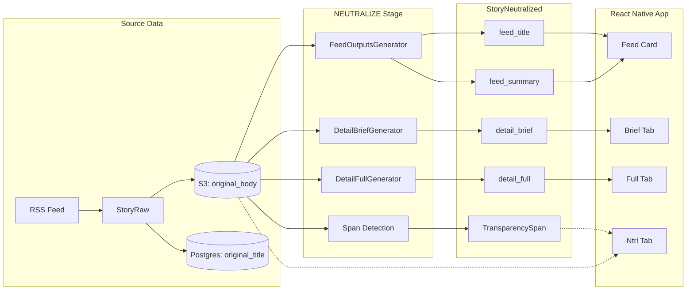
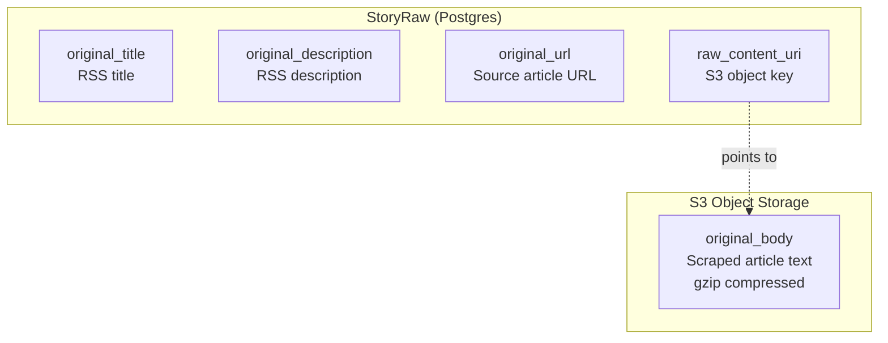
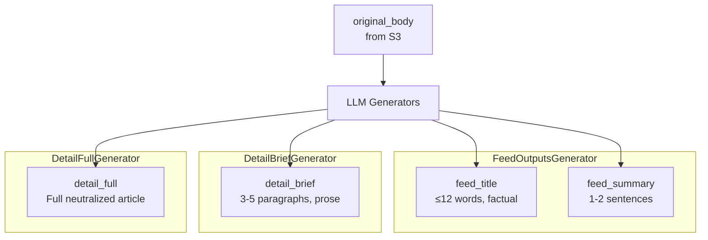
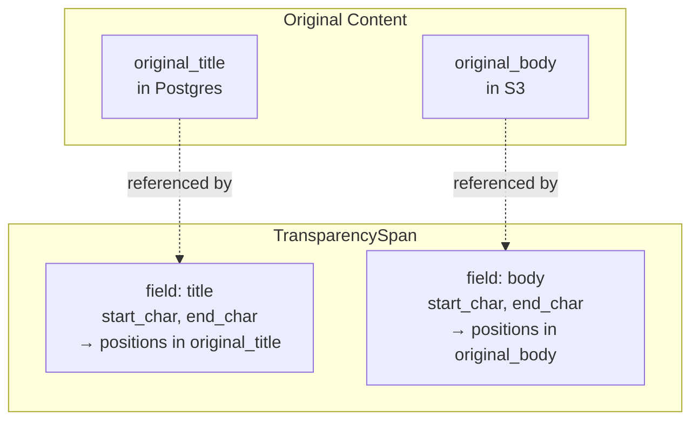
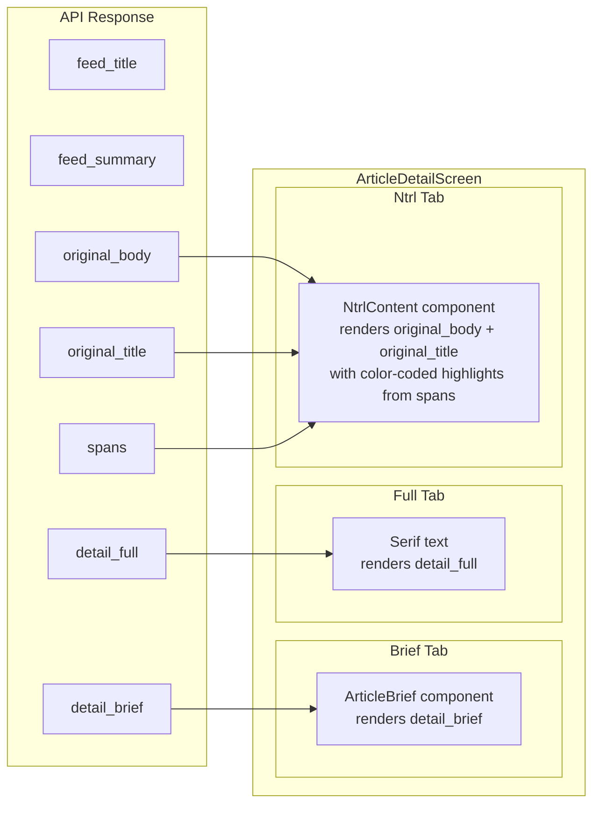

# Article Content Fields Data Flow

This document describes how content flows from source articles through the pipeline to the React Native app, clarifying which generators produce which fields and how spans reference original content.

## Data Flow Overview

## Source Data: StoryRaw

**Key fields:**

| Field | Storage | Description |
|-------|---------|-------------|
| `original_title` | Postgres | RSS feed title (not used for generation) |
| `original_description` | Postgres | RSS feed description (not used for generation) |
| `original_url` | Postgres | Link to source article |
| `raw_content_uri` | Postgres | S3 key for full body |
| **original_body** | S3 | Scraped article text (canonical source) |

**Critical rule:** All neutralized outputs are derived solely from `original_body`. The RSS title/description are never used for LLM generation.

## Generator → Field Mapping

| Generator | Output Field(s) | Purpose | Length |
|-----------|-----------------|---------|--------|
| `FeedOutputsGenerator` | `feed_title` | Neutral headline for feed cards | ≤6 words (12 max) |
| `FeedOutputsGenerator` | `feed_summary` | One-line deck for feed cards | 1-2 sentences |
| `DetailBriefGenerator` | `detail_brief` | Synthesized summary for Brief tab | 3-5 paragraphs |
| `DetailFullGenerator` | `detail_full` | Neutralized full article for Full tab | Full length |

## Transparency Spans

**Critical invariant:** Spans always reference `original_body` (or `original_title`), **never** `detail_full`. The span character offsets point into the original text, not the neutralized output.

| Span Field | Reference | Description |
|------------|-----------|-------------|
| `field: "title"` | `original_title` | Manipulation in headline |
| `field: "body"` | `original_body` | Manipulation in article body |
| `start_char` | Character offset | Start position in referenced field |
| `end_char` | Character offset | End position (exclusive) |
| `original_text` | Extracted text | The flagged manipulative phrase |
| `action` | `removed`/`replaced`/`softened` | What was done |
| `reason` | SpanReason enum | Why (clickbait, urgency, emotional, etc.) |

## App Tab Consumption

| App Tab | Data Source | Display |
|---------|-------------|---------|
| **Feed Card** | `feed_title`, `feed_summary` | Neutral headline and deck |
| **Brief Tab** | `detail_brief` | LLM-synthesized summary, serif font |
| **Full Tab** | `detail_full` | Neutralized full article, serif font |
| **Ntrl Tab** | `original_body` + `spans` | Original text with category-colored highlights showing what was changed |

## Complete Field Inventory

### StoryRaw (stored in Postgres + S3)

| Field | Location | Used By |
|-------|----------|---------|
| `original_title` | Postgres | Ntrl tab display, span field="title" reference |
| `original_description` | Postgres | Not used (legacy RSS data) |
| `original_url` | Postgres | Source link in all views |
| `raw_content_uri` | Postgres | S3 key for body retrieval |
| **original_body** | S3 | All generators, Ntrl tab, span field="body" reference |

### StoryNeutralized (stored in Postgres)

| Field | Generator | Consumer |
|-------|-----------|----------|
| `feed_title` | FeedOutputsGenerator | Feed cards, search results |
| `feed_summary` | FeedOutputsGenerator | Feed cards, search results |
| `detail_title` | (optional, may be null) | Article header |
| `detail_brief` | DetailBriefGenerator | Brief tab |
| `detail_full` | DetailFullGenerator | Full tab |
| `disclosure` | (template) | Footer on manipulative articles |

### TransparencySpan (stored in Postgres)

| Field | Description |
|-------|-------------|
| `field` | `"title"` or `"body"` — which original field |
| `start_char` | Offset into original field |
| `end_char` | End offset (exclusive) |
| `original_text` | The flagged phrase |
| `action` | `removed`, `replaced`, `softened` |
| `reason` | `clickbait`, `urgency_inflation`, etc. |
| `replacement_text` | What it became (optional) |

## Key Invariants

1. **Single source of truth:** All LLM outputs derive from `original_body` in S3, never from RSS metadata.

2. **Spans reference originals:** `TransparencySpan.start_char`/`end_char` always index into `original_body` or `original_title`, never into `detail_full`.

3. **Feed vs Detail separation:** `feed_title`/`feed_summary` are for list views; `detail_brief`/`detail_full` are for article detail.

4. **Ntrl tab shows original:** The transparency view displays `original_body` with highlights, not any neutralized output.

5. **No RSS title in outputs:** The generator prompts explicitly read from `original_body`; the RSS `original_title` is display-only.

## Key Files

| Component | Location |
|-----------|----------|
| StoryRaw model | `app/models.py:241` |
| StoryNeutralized model | `app/models.py:378` |
| TransparencySpan model | `app/models.py:473` |
| FeedOutputsGenerator | `app/services/ntrl_fix/feed_outputs_gen.py` |
| DetailBriefGenerator | `app/services/ntrl_fix/detail_brief_gen.py` |
| DetailFullGenerator | `app/services/ntrl_fix/detail_full_gen.py` |
| Story transparency endpoint | `app/routers/stories.py:311` (`GET /{id}/transparency`) |
| ArticleDetailScreen (app) | `../ntrl-app/src/screens/ArticleDetailScreen.tsx` |
| NtrlContent component | `../ntrl-app/src/components/NtrlContent.tsx` |
