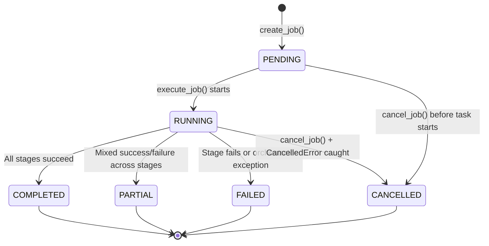
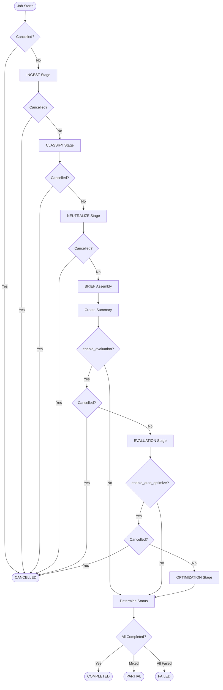
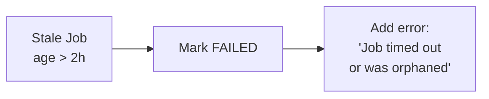

# Async Pipeline Job State Machine

This document describes the state machine for async pipeline jobs, including all valid states, transitions, and stage execution flow.

## Job Status State Diagram



## State Descriptions

| Status | Description | Terminal? |
|--------|-------------|-----------|
| `PENDING` | Job created, waiting for background task to start | No |
| `RUNNING` | Background task executing, stages in progress | No |
| `COMPLETED` | All stages finished successfully | Yes |
| `PARTIAL` | Some stages succeeded, others failed | Yes |
| `FAILED` | First stage failed or orchestrator exception | Yes |
| `CANCELLED` | Job was cancelled via `cancel_job()` | Yes |

## Transition Triggers

| From | To | Trigger |
|------|-----|---------|
| `[*]` | `PENDING` | `PipelineJobManager.start_job()` creates job record |
| `PENDING` | `RUNNING` | `_execute_job()` background task starts, sets `started_at` |
| `PENDING` | `CANCELLED` | `cancel_job()` called before task begins (task.cancel() on pending task) |
| `RUNNING` | `COMPLETED` | `_determine_overall_status()` finds all stages "completed" |
| `RUNNING` | `PARTIAL` | Some stages "completed", others "failed" |
| `RUNNING` | `FAILED` | All stages "failed" or unhandled exception in orchestrator |
| `RUNNING` | `CANCELLED` | `asyncio.CancelledError` caught in `_execute_job()` |

## Stage Execution Flow

The orchestrator executes stages sequentially with cancellation checks between each:



## Stage-Level Status

Each stage produces its own status independent of the job status:

| Stage Status | Meaning |
|--------------|---------|
| `completed` | Stage finished without errors |
| `partial` | Stage finished with some errors (e.g., classify had failures) |
| `failed` | Stage threw exception |
| `skipped` | Stage was not run (e.g., optimization without evaluation) |

## Cancellation Handling

1. **User requests cancellation**: `cancel_job()` sets `cancel_requested=True` in DB and calls `task.cancel()`
2. **Orchestrator checks**: `_check_cancelled()` polls DB between stages
3. **Task receives signal**: `asyncio.CancelledError` raised
4. **Cleanup**: Job status set to `CANCELLED`, `finished_at` recorded

```python
# Cancellation check between stages
if await self._check_cancelled():
    return self._build_cancelled_result()
```

## Stale Job Cleanup

Jobs stuck in `PENDING` or `RUNNING` for >2 hours are marked `FAILED` by `cleanup_stale_jobs()`:



## Key Files

| Component | Location |
|-----------|----------|
| `PipelineJobStatus` enum | `app/models.py:163` |
| `PipelineJobManager` | `app/services/pipeline_job_manager.py` |
| `AsyncPipelineOrchestrator` | `app/services/async_pipeline_orchestrator.py` |
| Job endpoints | `app/routers/admin.py` (search for `/pipeline/jobs`) |
