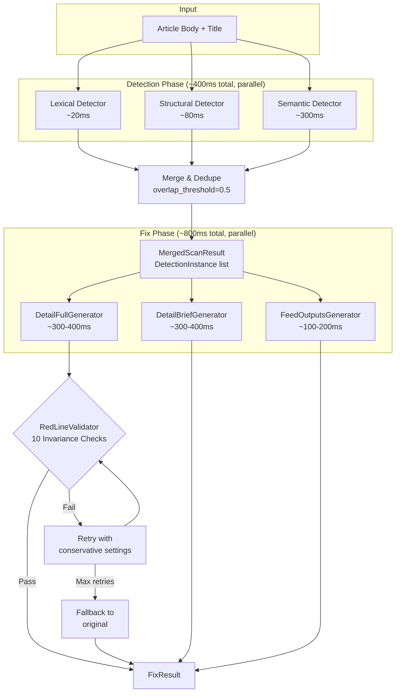
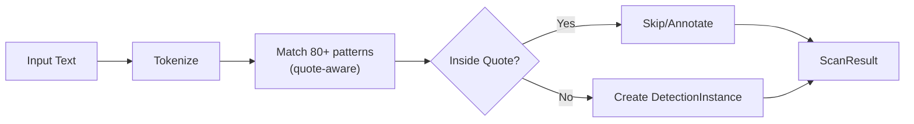
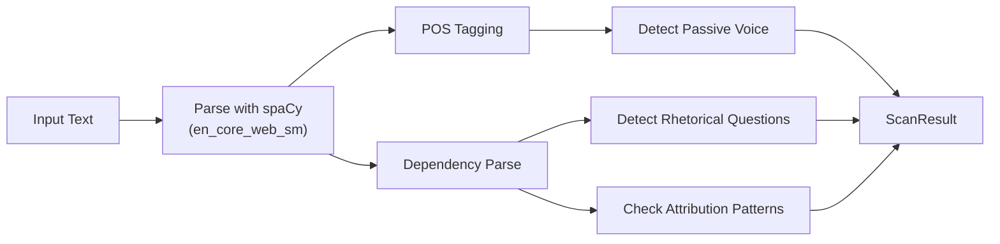
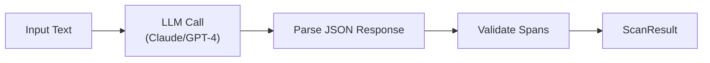
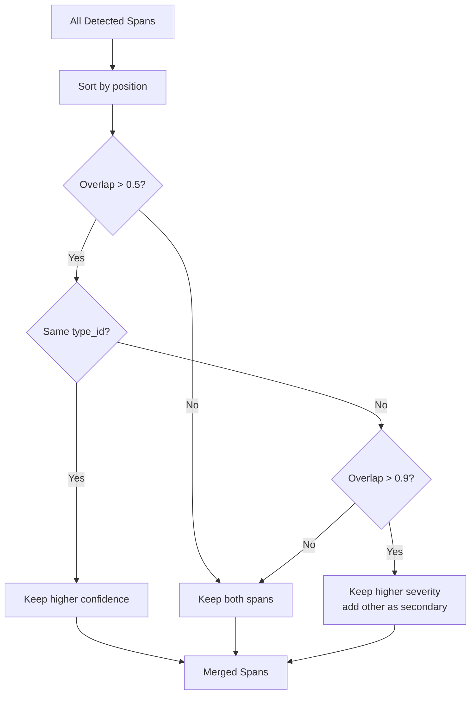
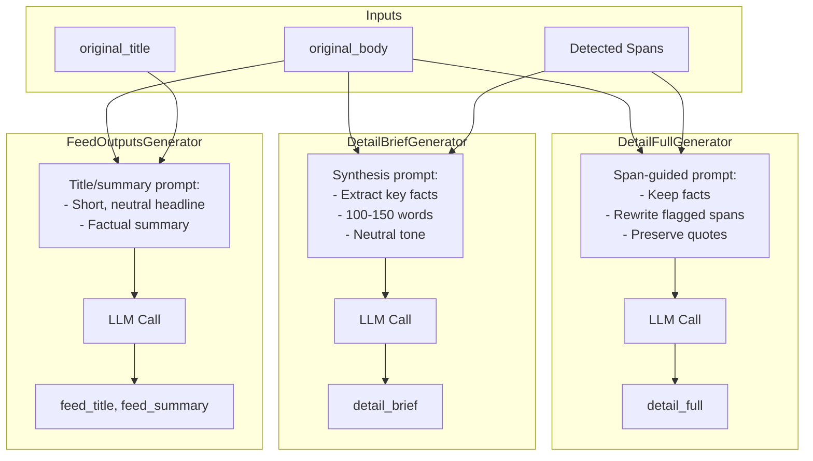
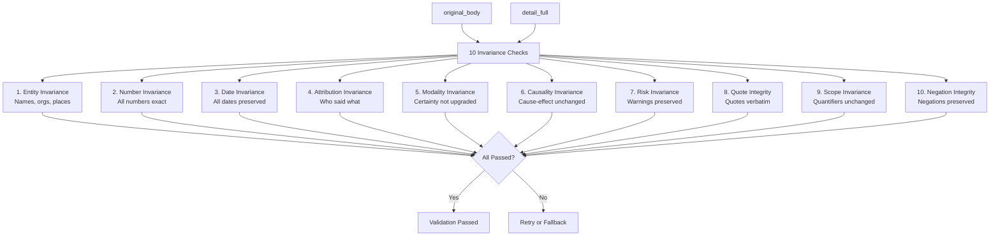

# NTRL Filter v2 Pipeline

This document describes the two-phase NTRL Filter v2 architecture: detection (ntrl-scan) and rewriting (ntrl-fix).

## Pipeline Overview



## Detection Phase: ntrl-scan

Three complementary detectors run in parallel, each with different strengths:

### Detector Comparison

| Detector | Latency | Method | Strengths | Detects |
|----------|---------|--------|-----------|---------|
| **Lexical** | ~20ms | Regex patterns | Fast, predictable | Loaded language, sensationalism, obvious bias markers |
| **Structural** | ~80ms | spaCy NLP | Grammar-aware | Passive voice, rhetorical questions, attribution patterns |
| **Semantic** | ~300ms | LLM-based | Context-aware | Subtle manipulation, inference, connotation |

### Lexical Detector



**Key features:**
- Quote-aware: Patterns inside direct quotes are exempted
- Pattern library: 80+ regex patterns from manipulation taxonomy
- Categories: A (Attention), B (Emotional), D (Linguistic)

### Structural Detector



**Key features:**
- Grammar-based: Uses dependency parsing and POS tags
- Structural patterns: Passive voice, sentence structure
- Attribution analysis: Who-said-what patterns

### Semantic Detector



**Semantic types detected (9 categories):**
1. Implied causation (unstated cause-effect)
2. Connotation manipulation (positive/negative framing)
3. Selective emphasis (cherry-picking facts)
4. False balance (both-sides-ism)
5. Loaded presupposition (hidden assumptions)
6. Appeal to emotion (fear, outrage, pity)
7. Vague attribution ("critics say")
8. Implied consensus ("everyone knows")
9. Strategic omission (missing key context)

### Merge & Dedupe

When spans from multiple detectors overlap:



**Segment multipliers** adjust severity based on article location:
- Title: 1.5x (highest impact)
- Deck: 1.3x
- Lede: 1.2x
- Body: 1.0x (baseline)
- Pullquote: 0.6x (quotes get lower weight)

## Fix Phase: ntrl-fix

Three generators run in parallel, each producing a different output:

### Generator Responsibilities

| Generator | Output Field | Purpose |
|-----------|--------------|---------|
| **DetailFullGenerator** | `detail_full` | Full neutralized article text |
| **DetailBriefGenerator** | `detail_brief` | Condensed summary for Brief tab |
| **FeedOutputsGenerator** | `feed_title`, `feed_summary` | Neutralized headline and deck |



### RedLine Validator

Validates `detail_full` against `original_body` using 10 invariance checks:



**Critical checks** (failures always block):
- Entity Invariance
- Number Invariance
- Quote Integrity
- Negation Integrity

**Non-strict mode** allows warnings for:
- Attribution Invariance
- Causality Invariance
- Scope Invariance

## Output: FixResult

```python
@dataclass
class FixResult:
    detail_full: str          # Full neutralized article
    detail_brief: str         # Brief summary
    feed_title: str           # Neutralized headline
    feed_summary: str         # Neutralized deck
    changes: list[ChangeRecord]  # What was changed and why
    validation: ValidationResult # Validation status
    processing_time_ms: float
```

## Performance Summary

| Phase | Component | Latency | Notes |
|-------|-----------|---------|-------|
| Detection | Lexical | ~20ms | Regex patterns |
| Detection | Structural | ~80ms | spaCy NLP |
| Detection | Semantic | ~300ms | LLM call |
| Detection | **Total** | **~400ms** | Parallel execution |
| Fix | DetailFull | ~300-400ms | LLM call |
| Fix | DetailBrief | ~300-400ms | LLM call |
| Fix | FeedOutputs | ~100-200ms | LLM call |
| Fix | **Total** | **~800ms** | Parallel execution |
| **Pipeline** | **Total** | **~1.2s** | Detection + Fix |

## Key Files

| Component | Location |
|-----------|----------|
| NTRLScanner | `app/services/ntrl_scan/scanner.py` |
| LexicalDetector | `app/services/ntrl_scan/lexical_detector.py` |
| StructuralDetector | `app/services/ntrl_scan/structural_detector.py` |
| SemanticDetector | `app/services/ntrl_scan/semantic_detector.py` |
| NTRLFixer | `app/services/ntrl_fix/fixer.py` |
| DetailFullGenerator | `app/services/ntrl_fix/detail_full_gen.py` |
| DetailBriefGenerator | `app/services/ntrl_fix/detail_brief_gen.py` |
| FeedOutputsGenerator | `app/services/ntrl_fix/feed_outputs_gen.py` |
| RedLineValidator | `app/services/ntrl_fix/validator.py` |
| Manipulation Taxonomy | `app/taxonomy.py` |
